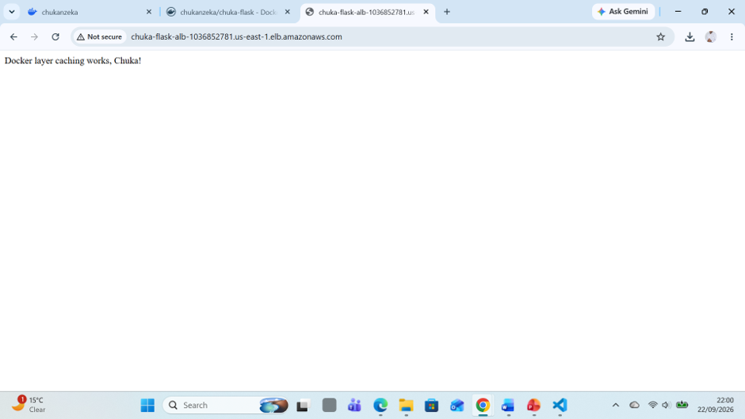

# chuka-flask

A Dockerised Python Flask web application deployed to AWS ECS Fargate using Terraform for infrastructure provisioning and Docker for containerisation.

## What this project demonstrates

- Containerising a Python web application with Docker
- Running a multi-container local development stack with Docker Compose
- Pushing a Docker image to AWS ECR (Elastic Container Registry)
- Deploying a containerised application to AWS ECS Fargate serverlessly
- Provisioning all AWS infrastructure as code using Terraform
- Routing traffic through an AWS Application Load Balancer

## Tech stack

| Technology | Purpose |
|---|---|
| Python / Flask | Web application |
| Docker | Containerisation |
| Docker Compose | Local multi-container development |
| AWS ECR | Private container image registry |
| AWS ECS Fargate | Serverless container deployment |
| AWS ALB | Load balancing and traffic routing |
| Terraform | Infrastructure as code |

## Architecture

Internet
    ↓
Application Load Balancer (port 80)
    ↓
ECS Fargate Task (Flask container, port 5000)
    ↓
AWS ECR (image storage)

## Run locally with Docker Compose

git clone https://github.com/chukanzeka/chuka-flask.git
cd chuka-flask
docker compose up -d

Visit http://localhost:5000

To stop:
docker compose down

## Deploy to AWS with Terraform

Prerequisites: AWS CLI configured, Terraform installed, Docker installed.

cd terraform
terraform init
terraform apply

After apply, authenticate Docker to ECR and push your image:

aws ecr get-login-password --region us-east-1 | docker login --username AWS --password-stdin ACCOUNT_ID.dkr.ecr.us-east-1.amazonaws.com
docker tag chuka-flask:v1 ACCOUNT_ID.dkr.ecr.us-east-1.amazonaws.com/chuka-flask:v1
docker push ACCOUNT_ID.dkr.ecr.us-east-1.amazonaws.com/chuka-flask:v1

To destroy all resources:
terraform destroy

## Live deployment screenshot

## Author

Chuka Nzeka
LinkedIn: https://www.linkedin.com/in/chuka-nzeka-a420711/
GitHub: https://github.com/chukanzeka
